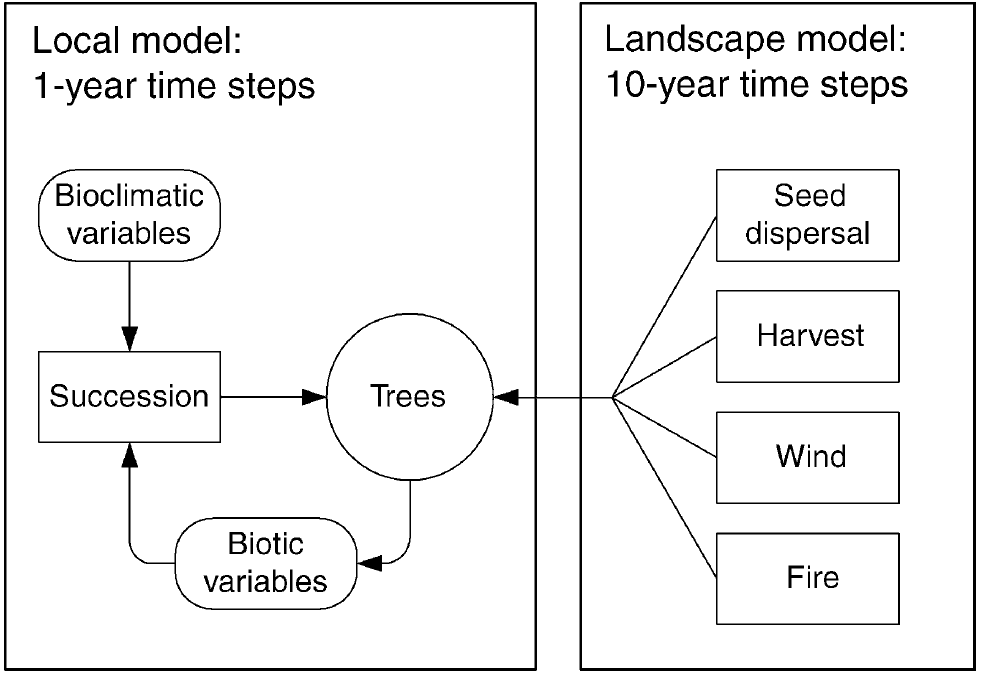
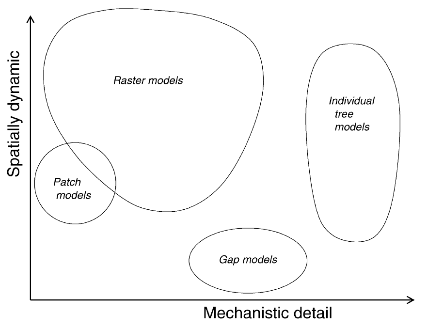
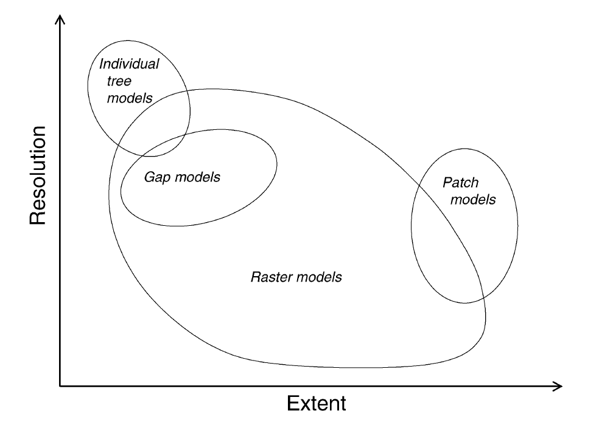

# LandClim overview {#intro}

## Structure of this book

This book describes the model LandClim. The [current section](#intro) provides an overview on the model, section [2](#science1) and [3](#science2) describes the science behind the model and its links to the source code. The (section 4)[\#implementation] describes how to implement the model and the (last section)[\#tutorials] is a collection of tutorials.

If you just want to try the model we recommend that you go to the [tutorials](#tutorials), if you want to understand the science behind the model explore the chapters [2](#science1) and [3](#science2), but if you are interested in using LandClim for your own research, have a look to the [implementation section](#implementation) and please get in touch with us.

## What is LandClim?

LandClim is a spatially explicit, dynamic forest landscape model which simulates vegetation dynamics driven by competition, environmental conditions and disturbances at large scales \\citep{Schumacher2004}. 

## What LandClim does?

Landclim is a spatially explicit, raster-based, and stochastic model designed to simulate forest change in combination with disturbance regimes. The model simulates vegetation dynamics on large landscapes (100 --10^6^ ha) and over long time spans (e.g. hundreds of years) in 1 or 10 year time steps.

## How LandClim works?

The design of LandClim reflects processes at two spatial scales (Fig.1.1): (1) the patch scale (patches / grid-cells e.g. of 25 x 25 m) and (2) the landscape scale (large geographical areas up to several thousand hectares)

{#Fig_LandClimScheme width="650"}

At the patch scale, the processes that influence forest succession are simulated on an annual time-step. This includes the simulation of establishment, growth, reproduction, mortality, intra- and inter-specific competition. Although the probabilities for tree establishment and mortality are calculated annually, the actual occurrence of establishment and regeneration events is only once a decade. Similar to other forest models, LandClim does not simulate individual trees but rather uses a cohort approach, i.e. groups of trees of the same age and species \\citep{Bugmann2001}.

At the landscape scale, LandClim simulates how these patch scale processes are influenced by large-scale natural disturbances (e.g., fires, windthrow, bark beetles), forest management, and the physical environment. Interactions between cells and landscape scale processes are implemented on a decadal time step. Using different time-steps for different processes allows the model to efficiently simulate large landscapes, while maintaining a relatively fine spatial and thematic resolution.  

## Who is behind LandClim?

LandClim was originally created by Harald Bugmann and many collaborators and researchers working in the Forest Ecology group at ETH have been part of its development.

## Brief history of LandClim 

Forest landscape models emerged from the need to simulate processes at large spatial scales (100s ha to 1000s km) for research and management purposes \\citep{Mladenoff2004}. This includes processes such as seed dispersal, and disturbances (e.g., fire, windthrow, bark beetle, management). A key challenge is the trade-off between mechanistic detail and spatial dynamics ([Fig. X](#Fig_Mladenoff2004_Spatial_Mechanism)) as well as the trade-off between extent and resolution ([Fig.X](#Fig_Mladenoff2004_Extent_Resolution)). Raster-based models have the advantage of being computationally faster and capable of representing the greatest range of resolution and extent.

{#Fig_Mladenoff2004_Spatial_Mechanism}

{#Fig_Mladenoff2004_Extent_Resolution}

The development of LandClim was based on the structure of the raster-based LANDIS model \\citep{Mladenoff2004}. At this time, LANDIS Version 3.40 \\citep{He1999b} was not capable of simulating a number of important ecological processes important to capture forest dynamics in the Central European Alps \\citep{Schumacher2004}. This included: 

-   Interspecific competition effects during stand development. 

-   Species establishment probabilities that were self-emergent properties, which is pivotal for simulating the effects of changing environments (e.g., climate change) or transitions of species composition over climatic gradients.

-   Detailed quantitative descriptions of forest structure in each grid cell, (i.e. stem density, biomass, dbh, etc.), to simulate competition more accurately and assess the effects on landscape properties relevant for ecosystem management.

Therefore, the first version of LandClim featured a similar approach as used in the LANDIS model, but included an improved representation of tree growth and succession \\citep{Schumacher2004}. The tree growth ('stand scale') processes were based on a simplified version of the forest gap model FORCLIM \\citep{Bugmann1994}, in order to maintain computational efficiency at the large scale.   

Since the first LandClim release, the representation of forest dynamics at the patch and landscape scale has continuously been improved. This includes in particular improvements of tree growth, light and water competition, the inclusion of an herbaceous understorey layer, natural disturbances (e.g., fire and bark beetles), and various landscape-level management options (e.g, forest, pasture-woodland and meadows).

## Studies with LandClim

LandClim has been applied to a various study regions worldwide with different ecological focus (see [Table](#Table_LandClimStudies)). In particular, LandClim has been used to test palaeoecological hypotheses by simulating past forest dynamics \\citep{Henne2011, Henne2013, Schwoerer2014, Thrippleton2014} and to assess the impact of changing climate and disturbance regimes on ecosystem goods and services (EGS) \\citep{Schumacher2006, Elkin2012, Elkin2013, Temperli2013}.

| Paper                      | Location                                | Aim                           |
|----------------------------|-----------------------------------------|-------------------------------|
| \\citet{Schumacher2004a}}  | Dischma valley (Switzerland)            | Improving tree growth         |
| \\citet{Schumacher2006}}   | Dischma valley, Gantertal (Switzerland) | Fire regime, future climate\\ |
|                            |                                         |                               |
|                            |                                         |                               |
|                            |                                         |                               |
|                            |                                         |                               |
|                            |                                         |                               |
|                            |                                         |                               |
|                            |                                         |                               |
|                            |                                         |                               |
|                            |                                         |                               |
|                            |                                         |                               |
|                            |                                         |                               |
|                            |                                         |                               |
|                            |                                         |                               |
|                            |                                         |                               |
|                            |                                         |                               |
|                            |                                         |                               |
|                            |                                         |                               |
|                            |                                         |                               |
|                            |                                         |                               |
|                            |                                         |                               |
|                            |                                         |                               |
|                            |                                         |                               |
|                            |                                         |                               |
|                            |                                         |                               |
|                            |                                         |                               |
|                            |                                         |                               |
|                            |                                         |                               |
|                            |                                         |                               |

: Table of studies using LandClim

## How to use LandClim?

### Downloading LandClim

How to download the code and the manuals etc support

You can either download the source code (here)[add web link here] or directly download the executable files from (here)[add web link here].

### Using the source code

After (downloading the LandClim source code )[\#\#\# Downloading LandClim] you will have to publish the model to obtain the executable files. For this you need to have installed the software netcoreapp/dotnet and navigate in the comand line until the src code:

landclim\<src

then you will indicate any of the following executable commands depending on the operative system:

(please notice that the framework netcoreapp version should correspond with the version you have installed, in the following example is the 3.1)

#### Publishing an executable (Windows / Mac / Linux)

You can create an executable file for Windows (.exe), MacOS or Linux by using the publishing feature in Visual Studio or by executing the following command in the command line of your computer:

##### Windows (DotNet Core 3.1)

`dotnet publish -c Release --framework netcoreapp3.1 --runtime win-x64`

##### MacOS (DotNet Core 3.1))

`dotnet publish -c Release --framework netcoreapp3.1 --runtime osx-x64`

##### Linux (DotNet Core 3.1))

`dotnet publish -c Release --framework netcoreapp3.1 --runtime linux-x64`

## How to cite LandClim and this documentation

## Version and open access

Link to the code and last version release.

#### 

## 
